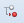

Méta
=====
Cette option permet la configuration de la Méta. 

	.. image:: ./images/meta.png
	
	*Figure 38 : option Méta du menu.*	

Si vous cliquez sur une composante de la Méta (côté gauche de la Figure 38), les propriétés s'affichent sur le côté droit.

Configuration de la Méta 
""""""""""""""""""""""""
Pour changer, la configuration de la Méta :

1. Sélectionnez la Méta (le dossier racine).
2. La liste des propriétés s'affiche à droite.
3. Changer les propriétés voulues, certaines sont non modifiables.
4. Cliquez sur |img| pour enregistrer.

 .. note:: voir :doc:`annexe <annexe>` pour la signification des propriétés.
	
Configuration des champs 
"""""""""""""""""""""""""
Pour changer la configuration d'un champ :

1. Double-cliquez sur **fieldsBase** ou **fieldsAdmin** pour afficher leurs contenus:

 - **fieldsBase :** contient les attributs de base de l'entité. 
 - **fieldsAdm :** contient les clés étrangères de l'entité.
 
2. Sélectionnez le champ à modifier.
3. La liste des propriétés s'affiche à droite.
4. Changer les propriétés voulues, certaines sont non modifiables.
5. Cliquez sur |img| pour enregistrer.
	
 .. note:: voir :doc:`annexe <annexe>` pour la signification des propriétés.

Configuration des actions 
"""""""""""""""""""""""""
**actions :** contient les actions définies sur l'objet courant (qui sont les actions de la fonction actions du :doc:`menu des fonctions <menu_fonctions>`).
 
En cliquant sur cette composante, le bouton d'ajout |img1| apparait, mais pour le moment les actions doivent être définies dans le modèle django.

Double-cliquez sur ce dossier pour afficher la liste des actions de l'objet.

 .. note:: voir :doc:`annexe <annexe>` pour la signification des propriétés.

Configuration des détails 
"""""""""""""""""""""""""
**detailsConfig :** liste des objets auxquels on peut naviguer à partir de l'objet courant (voir :doc:`détails <option_details>`).

 .. note:: voir :doc:`annexe <annexe>` pour la signification des champs.

Configuration des templates HTML
""""""""""""""""""""""""""""""""
**sheetConfig :** permet de définir des templates HTML.

Pour définir un nouveau template :

1. cliquez sur sheetConfig;
2. cliquez sur |img1| puis entrer le nom du nouveau template;
3. ou double-cliquez sur sheetConfig pour accéder aux templates définis;
4. sélectionnez le template;
5. la liste des propriétés s'affiche à droite;
6. modifiez le template en modifiant les propriétés;
7. cliquez sur |img| pour enregistrer;
8. pour supprimer un template, Sélectionnez-le et cliquez sur |img2|;
9. cliquez sur |img| pour enregistrer.

 .. note:: voir :doc:`annexe <annexe>` pour la signification des propriétés.

Configuration de la grille
""""""""""""""""""""""""""
	
**gridConfig :** à partir de cette option vous pouvez configurer la grille principale.

Cliquez sur **gridConfig** pour accéder à ses propriétés ;

 1. la liste des propriétés s'affiche à droite;
 2. changer les propriétés voulues, certaines sont non modifiables;
 3. cliquez sur |img| pour enregistrer.

 .. note:: voir :doc:`annexe <annexe>` pour la signification des propriétés.

Double-cliquez sur **gridConfig** pour à accéder aux sous-options :

- **listDisplay :** sert à personnaliser l'affichage et l'ordre d'apparition de champs sur la grille.

- **baseFilter :** permet de définir des filtres de bases qui peuvent être utilisés pour la fonction Rechercher.  

- **initialFilter :** permet de définir le filtre initial qui est utilisé pour la grille par défaut.

- **initialSort :** permet de configurer l'ordre d'apparition (ascendante ou descendante) pour un champ de la grille. 
  Quand la grille est chargée, elle affiche son contenu ordonné par le champ configuré avec initialSort. Les valeurs possibles 
  sont: ASC ou DESC.

- **searchFields :** sert à choisir les champs qui seront pris en compte au moment de faire une recherche sur le contenu de la grille. Cette propriété est utilisée avec la propriété « searchable » d'un champ.

- **sortFields :** sert à choisir les champs qui seront pris en compte au moment de faire le classement du contenu de la grille. Cette propriété est utilisée avec la propriété « sortable » d'un champ.

- **hiddenFields :** sélectionnez les champs pour les cacher de la grille. Notez que cette fonctionnalité cache un champ à l'affichage, elle ne l'efface pas de l'application.

- **readOnlyFields :** sélectionnez les champs pour les rendre non modifiables par l'utilisateur. 

Pour **listDisplay**, **searchFields**, **sortFields**, **hiddenFields** et **readOnlyFields** :
 
1. sélectionnez l'une de ces options;
2. activer ou desactiver les champs;
3. cliquez sur |img| pour enregistrer.

Pour **baseFilter**, **initialFilter** et **initialSort** :
 
1. sélectionnez l'une de ces options;
2. le bouton |img1| s'affiche en haut à côté du |img|;
3. cliquez sur ce bouton et entrez le nom de la colonne à ajouter aux filtres ou aux tris;
4. cliquez sur |img| pour enregistrer;
5. pour supprimer un filtre ou un tri, sélectionner-le et cliquez sur |img2|;
6. cliquez sur |img| pour enregistrer.

Pour **gridSets :**  même rôle que :doc:`l'option configuration <option_configuration>`.

Configuration des formulaires
"""""""""""""""""""""""""""""
**formConfig :** personnalise la présentation du formulaire. Le formulaire peut être personnalisé à partir de deux endroits: formConfig 
dans l'option Méta ou dans l'option formulaire du menu de configuration. On vous recommande de vous servir de :doc:`l'option formulaire <option_formulaire>`
parce qu'elle est plus conviviale pour la personnalisation.

Configuration des propriétés des utilisateurs
"""""""""""""""""""""""""""""""""""""""""""""
**usrDefProps :** propriétés définies par l'utilisateur.

 .. note:: voir :doc:`annexe <annexe>` pour la signification des propriétés.

Configuration par les simples utilisateurs 
""""""""""""""""""""""""""""""""""""""""""
**custom :** voir :doc:`l'option configuration <option_configuration>`.

Configuration des règles d'affaires
"""""""""""""""""""""""""""""""""""
**businessRules :** option non fonctionnelle pour le moment. Elle sera utilisée pour définir les règles d'affaires à partir de l'application.

.. |img| image:: ./images/saveform.png
.. |img1| image:: ./images/addUDP.png
